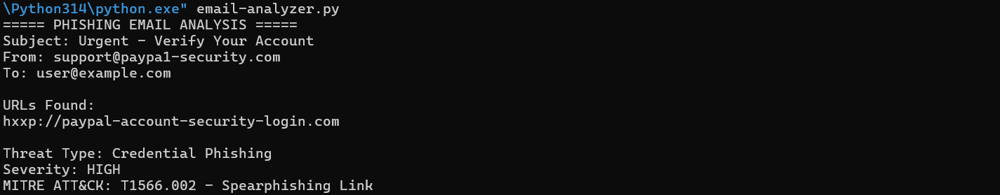

# Phishing Email Analysis Report

## Objective

Analyze a suspicious email to identify phishing indicators and assess the threat.

## Email Summary

Sender: support@paypa1-security.com

Subject: Urgent - Verify Your Account

## Findings

### Suspicious Sender

The domain uses "paypa1" instead of "paypal", indicating domain impersonation.

### Suspicious URL

http://paypal-account-security-login.com

The URL does not belong to the legitimate PayPal domain.

### Social Engineering Indicators

- Creates urgency.
- Threatens account suspension.
- Encourages immediate action.

## Indicators of Compromise (IOCs)

### Email Address

support@paypa1-security.com

### URL

http://paypal-account-security-login.com

## Severity

HIGH

## Threat Type

Credential Phishing

## MITRE ATT&CK Mapping

Technique:
T1566.002 - Phishing: Spearphishing Link

Tactic:
Initial Access

## Evidence Screenshot

### Python Email Analysis Output

## Recommendations

- Do not click suspicious links.
- Verify sender domains.
- Report phishing emails to security teams.
- Enable Multi-Factor Authentication (MFA).

## Conclusion

The email contains multiple phishing indicators and should be classified as a high-risk credential phishing attempt.
